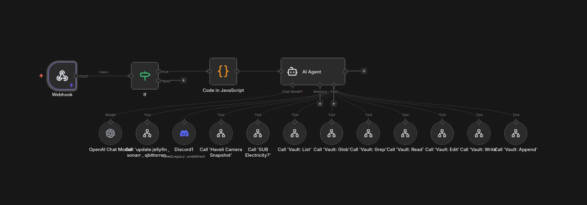

# WorkerBot

A Discord-controlled personal assistant that manages an [Obsidian](https://obsidian.md/) vault and homelab infrastructure, powered entirely by a **locally self-hosted LLM** (Qwen 2.5 1.5B via [llama.cpp](https://github.com/ggerganov/llama.cpp)) — no cloud API calls.

Built with [n8n](https://n8n.io/) as a set of modular workflows.



## How it works

1. A Discord bot forwards messages to a webhook on the n8n instance.
2. An **If** node gates access — only messages from the bot owner are processed.
3. A **Code** node walks the mounted Obsidian vault (`/vault`) and builds a live directory tree map of every folder and `.md` file.
4. An **AI Agent** node receives the user's message, today's date, and the vault map, then decides which tools to call. The agent runs on a locally hosted Qwen 2.5 1.5B (quantized, via llama.cpp) — zero external API dependency.

The agent has access to 11 tools, each implemented as a separate n8n sub-workflow:

### Obsidian vault operations

| Tool | Description |
|------|-------------|
| **Vault: Read** | Read a note with optional line-range slicing |
| **Vault: Write** | Create or overwrite a note (overwrite-protected by default) |
| **Vault: Edit** | Exact find-and-replace with uniqueness validation |
| **Vault: Append** | Append to a note (auto-creates if missing) |
| **Vault: List** | List files/folders, optionally recursive |
| **Vault: Glob** | Find files matching glob patterns (`**`, `*`, `?`) |
| **Vault: Grep** | Full-text search across all notes |

### Homelab tools

| Tool | Description |
|------|-------------|
| **Docker Update** | Pull and restart media stack containers (Jellyfin, Sonarr, Radarr, Bazarr, Prowlarr, qBittorrent, MySpeed, Jellyseerr) |
| **Haveli Camera** | Grab a snapshot from a security camera and send it to Discord |
| **Electricity Check** | Check whether mains power is currently on or out |
| **Discord Reply** | Send the final response back to Discord |

## Design decisions

**Why a 1.5B model?** The system prompt enforces a strict 10-call iteration budget with rules like "use the MAP, don't discover" and "append > edit." Pre-generating the vault file tree and injecting it into every prompt means the model doesn't waste iterations on file discovery — it can go straight to the right path. This makes a tiny quantized model viable for the task.

**Why sub-workflows?** Each vault operation is a standalone n8n workflow (trigger + single Code node). This keeps the main workflow clean, makes individual tools independently testable, and lets n8n's built-in tool-calling wire them into the AI Agent as callable functions.

**Security model:** Every vault tool validates paths against the vault root to block path traversal, restricts operations to `.md` files, and skips hidden files/folders. The If node at the entry point ensures only the owner's Discord messages are processed — everyone else gets a rejection message.

## Architecture

```
Discord message
    |
    v
[Webhook] --> [If: owner?] --yes--> [Code: build vault map] --> [AI Agent]
                   |                                                 |
                   no                                    +-----------+-----------+
                   |                                     |           |           |
                   v                                  [Vault    [Homelab    [Discord
              [Discord:                                tools]    tools]      Reply]
               reject]
```

## Repository structure

```
WorkerBot/
  workflows/
    WorkerBot.json          # Main orchestrator workflow (import into n8n)
    tools/
      vault-read.js         # Read note contents with optional line range
      vault-write.js        # Create or overwrite a note
      vault-edit.js         # Find-and-replace in a note
      vault-append.js       # Append text to a note
      vault-list.js         # List vault files/folders
      vault-glob.js         # Glob pattern file search
      vault-grep.js         # Full-text search across notes
      vault-map.js          # Pre-generate vault directory tree
  docs/
    workflow-overview.png   # Screenshot of the n8n workflow
```

## Setup

### Prerequisites

- [n8n](https://n8n.io/) (self-hosted)
- [llama.cpp](https://github.com/ggerganov/llama.cpp) server running with a GGUF model (e.g. `qwen2.5-1.5b-instruct-q4_k_m.gguf`)
- A Discord bot that forwards messages to the n8n webhook
- An Obsidian vault directory mounted/accessible at `/vault` in the n8n container

### Configuration placeholders

The exported workflow JSON has all secrets and personal values replaced with placeholders. You need to fill these in after importing:

| Placeholder | Where | What to enter |
|---|---|---|
| `YOUR_WEBHOOK_PATH` | Webhook node → Path | The path segment for your n8n webhook (e.g. `my-workerbot`). n8n generates this when you create the node, or you can set a custom one. |
| `YOUR_WEBHOOK_ID` | Webhook node, Discord Reject, Discord Reply, Discord Output → webhookId | n8n auto-fills these when you configure each node — just re-select your webhook/credentials in the UI. |
| `YOUR_DISCORD_USERNAME` | If node → rightValue | Your Discord username (the one the bot should respond to). Everyone else gets rejected. |
| `YOUR_CREDENTIAL_ID` | OpenAI Chat Model node → credentials → id | Created automatically when you add an "OpenAI API" credential in n8n. Set the **Base URL** to your llama.cpp server (e.g. `http://192.168.1.50:8080/v1`) and leave the API key blank or set a dummy value. |
| `YOUR_WORKFLOW_ID` | Every tool-workflow node (Docker Update, Haveli Camera Snapshot, Electricity Check, Vault: List/Glob/Grep/Read/Edit/Write/Append) → workflowId | The ID of each sub-workflow you create in n8n. After creating a sub-workflow, open the tool node in WorkerBot and select it from the dropdown. |

### Discord credentials

The workflow uses three Discord webhook credentials for sending messages back. In n8n:

1. Go to **Credentials → Add Credential → Discord Webhook API**.
2. Paste your Discord channel webhook URL (from Discord → Channel Settings → Integrations → Webhooks).
3. Assign the credential to the **Discord Reject**, **Discord Reply**, and **Discord Output** nodes.

### LLM configuration

The OpenAI Chat Model node is configured to use a local llama.cpp server with the OpenAI-compatible API. To set this up:

1. In n8n, create an **OpenAI API** credential.
2. Set the **Base URL** to your llama.cpp server's address (e.g. `http://localhost:8080/v1` or `http://<LAN-IP>:8080/v1`).
3. The **API Key** can be any non-empty string (llama.cpp doesn't validate it, but n8n requires the field).
4. In the OpenAI Chat Model node, set the **Model** to your GGUF filename (e.g. `qwen2.5-1.5b-instruct-q4_k_m.gguf`).

### Steps

1. Import `workflows/WorkerBot.json` into n8n.
2. Create the seven vault tool sub-workflows in n8n. Each one uses "When executed by another workflow" as the trigger and a single Code node — paste the corresponding `.js` file from `workflows/tools/`.
3. Open each tool-workflow node in WorkerBot and select the sub-workflow you just created from the dropdown (this fills in the workflow ID).
4. Configure the OpenAI Chat Model credential and node (see above).
5. Configure the three Discord webhook credentials (see above).
6. Set your Discord username in the If node's condition.
7. Set up a Discord bot (e.g. using [discord.js](https://discord.js.org/)) to forward messages to the n8n webhook URL.
8. Activate the workflow.

## License

MIT
